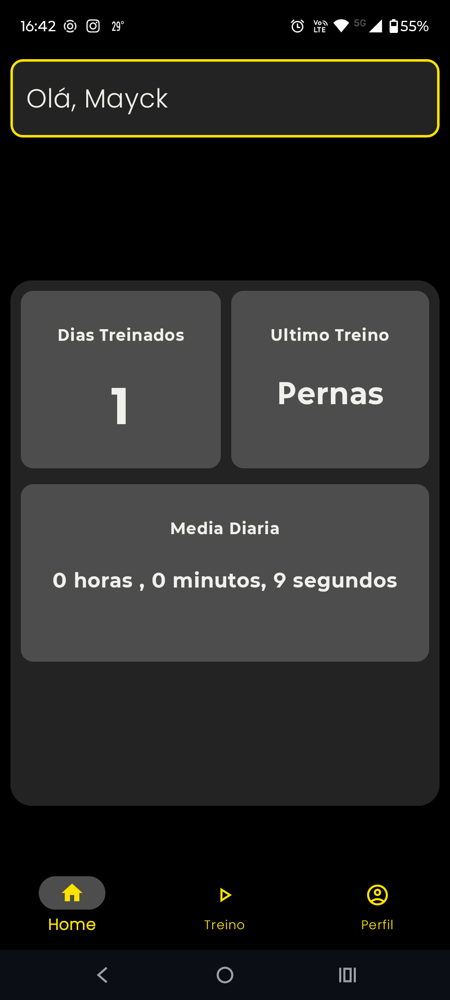
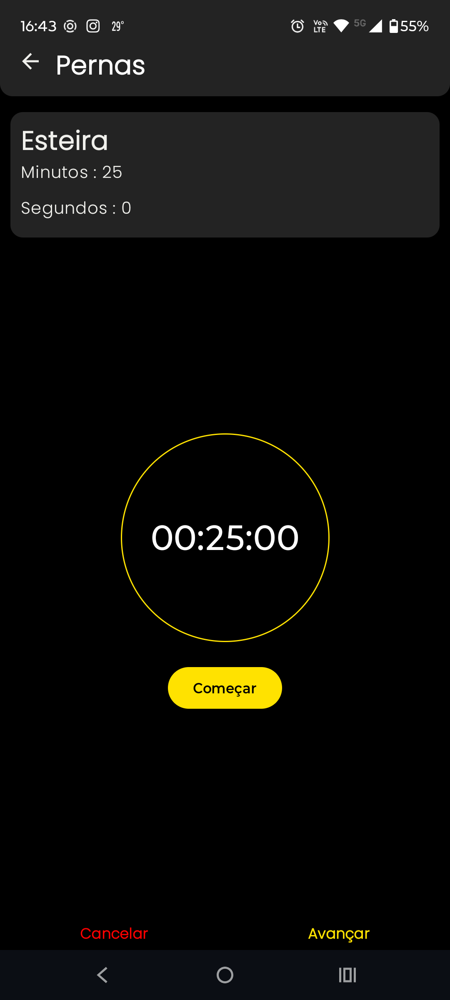
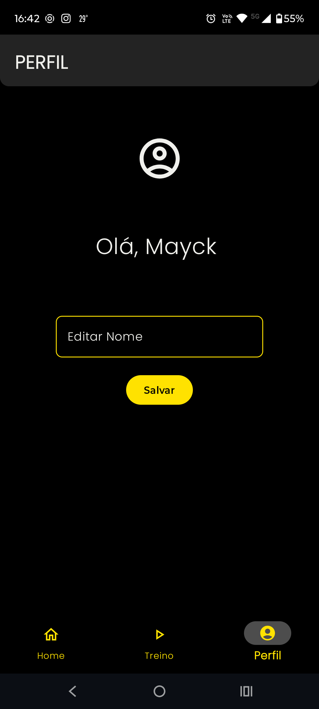
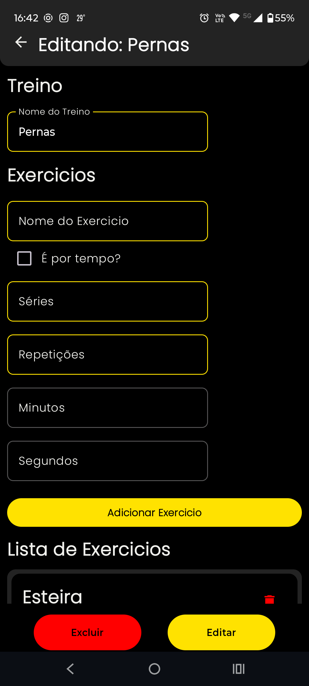

# PROJECT GYM

esse foi um projeto realizado para aprendizado de novas ferramentas do desenvolvimento android.

## Elementos usados:

- button
- text
- box
- navBar
- lazyColumn
- roomDB
- checkbox

## UI

| home | treinos | perfil | editando treino | treinando | final treino |
| --- | --- | --- | --- | --- | --- | 
|  |  |  |  |  |  |
